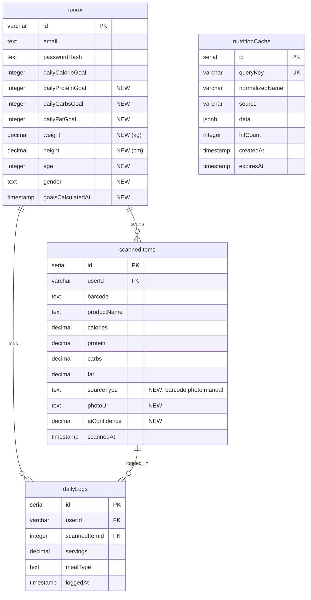

# Photo-Based Calorie Tracker with AI Estimation

## Enhancement Summary

**Deepened on:** 2026-02-01
**Research agents used:** performance-oracle, Context7 (TanStack Query, OpenAI), institutional learnings
**Sections enhanced:** 8

### Key Improvements

1. **Performance optimizations** - Multipart upload, image compression, parallel nutrition lookups (target: 3-6s P95)
2. **Memory management** - React Native image cleanup patterns from institutional learnings
3. **Type safety** - Zod schemas for all external API responses
4. **Race condition prevention** - Ref patterns for upload debouncing

### New Considerations Discovered

- Use `detail: 'low'` for Vision API (85 tokens vs high, 30-50% faster)
- Add nutrition caching layer (60x improvement on cache hits)
- TanStack Query mutation patterns for optimistic goal updates

---

## Overview

Add a premium feature that allows users to photograph any meal and receive AI-estimated calories and macros. The system uses GPT-4o Vision to identify foods, CalorieNinjas API to retrieve verified nutrition data, and supports smart follow-up questions when the AI is uncertain. Users can also set daily calorie and macro goals that are AI-calculated based on their physical profile.

**Brainstorm Reference:** `docs/brainstorms/2026-02-01-photo-calorie-tracker-brainstorm.md`

## Problem Statement / Motivation

Currently, users can only track nutrition via barcode scanning, which doesn't work for:

- Home-cooked meals
- Restaurant/takeout food
- Any food without a barcode

This limits the app's utility and creates friction in daily tracking. Photo-based estimation removes this barrier while maintaining convenience—the core product value.

**Business motivation:** This is a premium upsell feature to increase subscription conversion.

## Proposed Solution

### Architecture

```
┌─────────────────┐     ┌──────────────────┐     ┌─────────────────┐
│  React Native   │────▶│  Express Server  │────▶│  GPT-4o Vision  │
│  (Photo Capture)│     │  /api/analyze    │     │  (Food ID)      │
└─────────────────┘     └──────────────────┘     └─────────────────┘
                                │                         │
                                │                         ▼
                                │                 ┌───────────────┐
                                │                 │ CalorieNinjas │
                                │                 │ (Nutrition)   │
                                │                 └───────────────┘
                                │                         │
                                ▼                         ▼
                        ┌──────────────────┐     ┌───────────────┐
                        │  PostgreSQL      │◀────│ USDA Fallback │
                        │  (scannedItems)  │     │ (if not found)│
                        └──────────────────┘     └───────────────┘
```

### Research Insights: Architecture

**Performance Optimizations (from performance-oracle):**

- Use **multipart/form-data** instead of base64 in JSON (25-30% network reduction)
- **Parallel nutrition lookups** with `p-limit` (5 items: 500ms vs 2.5s sequential)
- Add **nutrition caching layer** in PostgreSQL (60x improvement on cache hits)
- Use `detail: 'low'` for Vision API (85 tokens, 512px, 30-50% faster)

**Estimated P95 After Optimizations:**
| Phase | Time |
|-------|------|
| Image capture + compress | 0.5s |
| Upload (1MB multipart) | 0.5-1s |
| GPT-4o Vision (low detail) | 2-4s |
| Nutrition lookup (parallel, cached) | 0.3-0.8s |
| DB storage | 0.1s |
| **Total** | **3.4-6.4s** |

---

### User Flows

**Flow 1: Photo Capture & Analysis**

1. User taps shutter button on Scan screen (or picks from gallery)
2. Premium gate check (shared limit with barcode scans)
3. Photo uploaded to server
4. GPT-4o Vision identifies foods in image
5. CalorieNinjas API retrieves nutrition data for each food
6. If AI confidence < 70%, trigger follow-up questions
7. Display results with edit capability
8. User confirms → saved to daily log

**Flow 2: Goal Setup**

1. User navigates to Profile → Goals section
2. If no goals set, prompt to complete physical profile
3. Collect: age, weight (kg/lbs), height (cm/ft-in), gender
4. Calculate TDEE using Mifflin-St Jeor formula
5. Apply goal modifier (lose weight: -500 cal, gain: +300 cal, etc.)
6. Calculate macro split based on goal type
7. Display calculated goals, allow manual adjustment
8. Save to user profile

**Flow 3: Daily Progress Tracking**

1. History screen shows progress bars for calories + macros
2. Color-coded: green (under), yellow (80-100%), red (over)
3. Tapping goal shows breakdown of logged items

## Technical Approach

### Phase 1: Schema & API Foundation

**Database Changes** (`shared/schema.ts`)

```typescript
// Add to users table
weight: decimal("weight", { precision: 5, scale: 2 }),        // kg
height: decimal("height", { precision: 5, scale: 2 }),        // cm
age: integer("age"),
gender: text("gender"),                                        // 'male' | 'female' | 'other'
dailyProteinGoal: integer("daily_protein_goal"),              // grams
dailyCarbsGoal: integer("daily_carbs_goal"),                  // grams
dailyFatGoal: integer("daily_fat_goal"),                      // grams
goalsCalculatedAt: timestamp("goals_calculated_at"),

// Add to scannedItems table
sourceType: text("source_type").default("barcode"),           // 'barcode' | 'photo' | 'manual'
photoUrl: text("photo_url"),                                   // S3 URL for photo scans
aiConfidence: decimal("ai_confidence", { precision: 3, scale: 2 }),
```

#### Research Insights: Database

**Add nutrition cache table for API response caching:**

```typescript
// NEW: Nutrition cache table (60x performance improvement on cache hits)
export const nutritionCache = pgTable(
  "nutrition_cache",
  {
    id: serial("id").primaryKey(),
    queryKey: varchar("query_key", { length: 255 }).notNull().unique(),
    normalizedName: varchar("normalized_name", { length: 255 }).notNull(),
    source: varchar("source", { length: 50 }).notNull(), // 'calorieninjas' | 'usda'
    data: jsonb("data").notNull(),
    hitCount: integer("hit_count").default(0),
    createdAt: timestamp("created_at").defaultNow(),
    expiresAt: timestamp("expires_at").notNull(),
  },
  (table) => ({
    queryKeyIdx: index("nutrition_cache_query_key_idx").on(table.queryKey),
    expiresAtIdx: index("nutrition_cache_expires_at_idx").on(table.expiresAt),
  }),
);
```

**New API Endpoints**

| Method | Path                               | Description                                   |
| ------ | ---------------------------------- | --------------------------------------------- |
| POST   | `/api/photos/analyze`              | Upload photo, get AI analysis                 |
| POST   | `/api/photos/analyze/:id/followup` | Submit follow-up answer, get refined estimate |
| POST   | `/api/photos/confirm`              | Confirm analysis and save to daily log        |
| GET    | `/api/goals`                       | Get user's current goals                      |
| POST   | `/api/goals/calculate`             | Calculate goals from profile data             |
| PUT    | `/api/goals`                       | Update goals (manual adjustment)              |

### Phase 2: AI Analysis Pipeline

**GPT-4o Vision Integration** (`server/services/photo-analysis.ts`)

```typescript
import OpenAI from "openai";
import { z } from "zod";

// Zod schemas for runtime validation (from institutional learning)
const foodItemSchema = z.object({
  name: z.string(),
  quantity: z.string(),
  confidence: z.number().min(0).max(1),
  needsClarification: z.boolean(),
  clarificationQuestion: z.string().optional(),
});

const analysisResultSchema = z.object({
  foods: z.array(foodItemSchema),
  overallConfidence: z.number().min(0).max(1),
  followUpQuestions: z.array(z.string()),
});

export type FoodItem = z.infer<typeof foodItemSchema>;
export type AnalysisResult = z.infer<typeof analysisResultSchema>;

async function analyzePhoto(imageBase64: string): Promise<AnalysisResult> {
  const startTime = Date.now();

  const response = await openai.chat.completions.create({
    model: "gpt-4o",
    max_tokens: 500, // Limit for speed
    messages: [
      {
        role: "system",
        content: `You are a nutrition analysis assistant. Analyze food photos and identify:
1. Each distinct food item visible
2. Estimated portion size (e.g., "1 cup", "6 oz")
3. Your confidence level (0-1)
4. If uncertain about anything, include a clarifying question

Respond with JSON only. Be concise.`,
      },
      {
        role: "user",
        content: [
          {
            type: "text",
            text: "Identify all foods in this image with portion estimates:",
          },
          {
            type: "image_url",
            image_url: {
              url: `data:image/jpeg;base64,${imageBase64}`,
              detail: "low", // 85 tokens, 512px - faster processing
            },
          },
        ],
      },
    ],
    response_format: { type: "json_object" },
  });

  const content = response.choices[0]?.message?.content || "{}";

  // Safe parsing with Zod (from institutional learning)
  const parsed = analysisResultSchema.safeParse(JSON.parse(content));
  if (!parsed.success) {
    console.error("Vision API response validation failed:", parsed.error);
    return { foods: [], overallConfidence: 0, followUpQuestions: [] };
  }

  console.log(`Vision analysis completed in ${Date.now() - startTime}ms`);
  return parsed.data;
}
```

#### Research Insights: Vision API

**OpenAI Vision Detail Parameter (from Context7):**

- `detail: "low"` - 85 tokens, 512x512px, faster processing
- `detail: "high"` - Higher token cost, detailed analysis
- For food photos, `"low"` is usually sufficient

**Known Limitations:**

- Approximate counts only (not precise)
- Limited spatial reasoning
- Non-English text has reduced accuracy

---

**CalorieNinjas Integration** (`server/services/nutrition-lookup.ts`)

```typescript
import pLimit from "p-limit";
import { z } from "zod";

// Rate limiting for parallel requests
const RATE_LIMIT = 5;
const limit = pLimit(RATE_LIMIT);

// Zod schema for API response validation
const nutritionDataSchema = z.object({
  name: z.string(),
  calories: z.number(),
  protein_g: z.number(),
  carbohydrates_total_g: z.number(),
  fat_total_g: z.number(),
  fiber_g: z.number().optional().default(0),
  sugar_g: z.number().optional().default(0),
  sodium_mg: z.number().optional().default(0),
});

export type NutritionData = z.infer<typeof nutritionDataSchema> & {
  source: "calorieninjas" | "usda" | "cache";
};

// Parallel batch lookup with caching
export async function batchNutritionLookup(
  items: string[],
): Promise<Map<string, NutritionData | null>> {
  const results = new Map<string, NutritionData | null>();

  // Check cache first
  const cached = await getCachedNutrition(items);
  for (const [item, data] of cached) {
    results.set(item, data);
  }

  const uncached = items.filter((item) => !results.has(item));

  // Parallel lookup with rate limiting
  const lookupPromises = uncached.map((item) =>
    limit(async () => {
      const data = await lookupNutrition(item);
      if (data) {
        await cacheNutrition(item, data);
      }
      return { item, data };
    }),
  );

  const freshResults = await Promise.all(lookupPromises);
  for (const { item, data } of freshResults) {
    results.set(item, data);
  }

  return results;
}

async function lookupNutrition(query: string): Promise<NutritionData | null> {
  const response = await fetch(
    `https://api.calorieninjas.com/v1/nutrition?query=${encodeURIComponent(query)}`,
    { headers: { "X-Api-Key": process.env.CALORIENINJAS_API_KEY! } },
  );

  const data = await response.json();

  if (data.items?.length > 0) {
    const parsed = nutritionDataSchema.safeParse(data.items[0]);
    if (parsed.success) {
      return { ...parsed.data, source: "calorieninjas" };
    }
  }

  // Fallback to USDA
  return lookupUSDA(query);
}
```

### Phase 3: Goal Calculation

**TDEE Calculation** (`server/services/goal-calculator.ts`)

```typescript
import { z } from "zod";

// Validate user input with Zod
export const userPhysicalProfileSchema = z.object({
  weight: z.number().min(20).max(500), // kg, reasonable bounds
  height: z.number().min(50).max(300), // cm, reasonable bounds
  age: z.number().int().min(13).max(120),
  gender: z.enum(["male", "female", "other"]),
  activityLevel: z.string(),
  primaryGoal: z.string(),
});

export type UserPhysicalProfile = z.infer<typeof userPhysicalProfileSchema>;

interface CalculatedGoals {
  dailyCalories: number;
  dailyProtein: number; // grams
  dailyCarbs: number; // grams
  dailyFat: number; // grams
}

export function calculateGoals(profile: UserPhysicalProfile): CalculatedGoals {
  // Mifflin-St Jeor formula for BMR
  let bmr: number;
  if (profile.gender === "male") {
    bmr = 10 * profile.weight + 6.25 * profile.height - 5 * profile.age + 5;
  } else {
    bmr = 10 * profile.weight + 6.25 * profile.height - 5 * profile.age - 161;
  }

  // Activity multiplier
  const activityMultipliers: Record<string, number> = {
    sedentary: 1.2,
    light: 1.375,
    moderate: 1.55,
    active: 1.725,
    athlete: 1.9,
  };
  const tdee = bmr * (activityMultipliers[profile.activityLevel] || 1.55);

  // Goal modifier with guardrails
  const goalModifiers: Record<string, number> = {
    lose_weight: -500,
    gain_muscle: +300,
    maintain: 0,
    eat_healthier: 0,
    manage_condition: 0,
  };
  let dailyCalories = Math.round(
    tdee + (goalModifiers[profile.primaryGoal] || 0),
  );

  // Guardrails: minimum 1200 cal for safety
  dailyCalories = Math.max(1200, dailyCalories);

  // Macro splits based on goal
  const macroSplits: Record<
    string,
    { protein: number; carbs: number; fat: number }
  > = {
    lose_weight: { protein: 0.4, carbs: 0.3, fat: 0.3 },
    gain_muscle: { protein: 0.35, carbs: 0.4, fat: 0.25 },
    maintain: { protein: 0.3, carbs: 0.4, fat: 0.3 },
    eat_healthier: { protein: 0.3, carbs: 0.45, fat: 0.25 },
    manage_condition: { protein: 0.3, carbs: 0.4, fat: 0.3 },
  };
  const split = macroSplits[profile.primaryGoal] || macroSplits.maintain;

  return {
    dailyCalories,
    dailyProtein: Math.round((dailyCalories * split.protein) / 4), // 4 cal/g protein
    dailyCarbs: Math.round((dailyCalories * split.carbs) / 4), // 4 cal/g carbs
    dailyFat: Math.round((dailyCalories * split.fat) / 9), // 9 cal/g fat
  };
}
```

### Phase 4: Client Implementation

**New Screens**

| Screen                | Purpose                                                       |
| --------------------- | ------------------------------------------------------------- |
| `PhotoAnalysisScreen` | Shows AI analysis results, follow-up questions, edit controls |
| `GoalSetupScreen`     | Collects physical profile data, shows calculated goals        |
| `GoalProgressScreen`  | Daily/weekly progress visualization                           |

**Image Compression** (`client/lib/image-compression.ts`)

```typescript
import { manipulateAsync, SaveFormat } from "expo-image-manipulator";
import * as FileSystem from "expo-file-system";

interface CompressionOptions {
  maxWidth?: number;
  maxHeight?: number;
  quality?: number;
  targetSizeKB?: number;
}

export async function compressImage(
  uri: string,
  options: CompressionOptions = {},
): Promise<string> {
  const {
    maxWidth = 1024,
    maxHeight = 1024,
    quality = 0.7,
    targetSizeKB = 900, // Leave buffer under 1MB
  } = options;

  // First pass: resize and compress
  let result = await manipulateAsync(
    uri,
    [{ resize: { width: maxWidth, height: maxHeight } }],
    { compress: quality, format: SaveFormat.JPEG },
  );

  // Check file size
  const fileInfo = await FileSystem.getInfoAsync(result.uri);
  const sizeKB = (fileInfo.size || 0) / 1024;

  // Adaptive quality reduction if still too large
  if (sizeKB > targetSizeKB && quality > 0.3) {
    const newQuality = Math.max(0.3, quality * (targetSizeKB / sizeKB));
    result = await manipulateAsync(
      uri,
      [{ resize: { width: maxWidth, height: maxHeight } }],
      { compress: newQuality, format: SaveFormat.JPEG },
    );
  }

  return result.uri;
}
```

**Photo Upload with Streaming** (`client/lib/photo-upload.ts`)

```typescript
import * as FileSystem from "expo-file-system";
import { tokenStorage } from "./token-storage";
import { getApiUrl } from "./query-client";

export async function uploadPhoto(uri: string): Promise<AnalysisResult> {
  const token = await tokenStorage.get();

  // Use multipart upload (not base64 in JSON) - 25-30% faster
  const uploadResult = await FileSystem.uploadAsync(
    `${getApiUrl()}/api/photos/analyze`,
    uri,
    {
      httpMethod: "POST",
      uploadType: FileSystem.FileSystemUploadType.MULTIPART,
      fieldName: "photo",
      headers: {
        Authorization: `Bearer ${token}`,
      },
    },
  );

  if (uploadResult.status !== 200) {
    throw new Error(`Upload failed: ${uploadResult.status}`);
  }

  return JSON.parse(uploadResult.body);
}
```

**PhotoAnalysisScreen** (`client/screens/PhotoAnalysisScreen.tsx`)

```typescript
import { useCallback, useRef, useState, useEffect } from "react";
import { useFocusEffect } from "@react-navigation/native";
import * as FileSystem from "expo-file-system";
import * as Haptics from "expo-haptics";

export function PhotoAnalysisScreen({ route, navigation }) {
  const { imageUri } = route.params;

  // State for UI
  const [analysisResult, setAnalysisResult] = useState<AnalysisResult | null>(
    null,
  );
  const [isAnalyzing, setIsAnalyzing] = useState(true);
  const [followUpIndex, setFollowUpIndex] = useState(0);
  const [editingItem, setEditingItem] = useState<number | null>(null);

  // Refs for synchronous checks (from institutional learning: stale-closure-callback-refs)
  const isUploadingRef = useRef(false);
  const abortControllerRef = useRef<AbortController | null>(null);

  // Memory cleanup on unmount (from institutional learning: useeffect-cleanup-memory-leak)
  useFocusEffect(
    useCallback(() => {
      return () => {
        // Abort any in-flight requests
        abortControllerRef.current?.abort();

        // Clean up image URI to free memory
        if (imageUri) {
          FileSystem.deleteAsync(imageUri, { idempotent: true });
        }
      };
    }, [imageUri]),
  );

  // Debounced upload with ref check
  const handleAnalyze = useCallback(async () => {
    if (isUploadingRef.current) return; // Synchronous check
    isUploadingRef.current = true;

    try {
      abortControllerRef.current = new AbortController();

      const compressed = await compressImage(imageUri);
      const result = await uploadPhoto(compressed);

      setAnalysisResult(result);
      Haptics.notificationAsync(Haptics.NotificationFeedbackType.Success);
    } catch (error) {
      if (error.name !== "AbortError") {
        console.error("Analysis failed:", error);
        Haptics.notificationAsync(Haptics.NotificationFeedbackType.Error);
      }
    } finally {
      isUploadingRef.current = false;
      setIsAnalyzing(false);
    }
  }, [imageUri]);

  useEffect(() => {
    handleAnalyze();
  }, [handleAnalyze]);

  // ... render
}
```

#### Research Insights: TanStack Query Mutations

**Goal Update with Optimistic Updates (from Context7):**

```typescript
// client/hooks/useGoalMutation.ts
import { useMutation, useQueryClient } from "@tanstack/react-query";

export function useGoalMutation() {
  const queryClient = useQueryClient();

  return useMutation({
    mutationFn: async (newGoals: CalculatedGoals) => {
      const response = await apiRequest("PUT", "/api/goals", newGoals);
      return response.json();
    },
    onMutate: async (newGoals) => {
      // Cancel outgoing refetches
      await queryClient.cancelQueries({ queryKey: ["goals"] });

      // Snapshot previous value
      const previousGoals = queryClient.getQueryData(["goals"]);

      // Optimistically update cache
      queryClient.setQueryData(["goals"], newGoals);

      // Return context for rollback
      return { previousGoals };
    },
    onError: (err, newGoals, context) => {
      // Rollback on error
      queryClient.setQueryData(["goals"], context?.previousGoals);
    },
    onSettled: () => {
      // Refetch to ensure server state
      queryClient.invalidateQueries({ queryKey: ["goals"] });
    },
  });
}
```

### Phase 5: Premium Integration

**Update PremiumFeatures** (`shared/types/premium.ts`)

```typescript
export interface PremiumFeatures {
  maxDailyScans: number; // Applies to BOTH barcode and photo
  videoRecording: boolean;
  photoAnalysis: boolean; // NEW: can use photo scanning
  macroGoals: boolean; // NEW: can set macro goals (not just calories)
}

export const TIER_FEATURES: Record<SubscriptionTier, PremiumFeatures> = {
  free: {
    maxDailyScans: 3,
    videoRecording: false,
    photoAnalysis: true, // Free users can try it (within scan limit)
    macroGoals: false, // Calorie goal only for free
  },
  premium: {
    maxDailyScans: Infinity,
    videoRecording: true,
    photoAnalysis: true,
    macroGoals: true,
  },
};
```

## Acceptance Criteria

### Functional Requirements

- [ ] User can take a photo of any meal and receive calorie/macro estimates
- [ ] AI asks smart follow-up questions when confidence < 70%
- [ ] User can edit any AI estimate before saving
- [ ] Photo scans appear in daily history with camera icon indicator
- [ ] User can set daily calorie and macro goals (P/C/F in grams)
- [ ] Goals are AI-calculated from physical profile (age, weight, height, gender, activity, goal)
- [ ] User can manually adjust calculated goals
- [ ] Daily progress shows calories and macros vs goals with color coding
- [ ] Photo scans count toward same daily limit as barcode scans
- [ ] Premium users have unlimited scans; free users limited to 3/day total

### Non-Functional Requirements

- [ ] Photo analysis completes in < 10 seconds (p95) — **target 3-6s with optimizations**
- [ ] AI achieves > 80% accuracy on common foods (validated manually)
- [ ] Photo upload compressed to < 1MB before transmission
- [ ] Error states handled gracefully with retry options
- [ ] Memory cleaned up when navigating away from photo screens

### Quality Gates

- [ ] Unit tests for goal calculation (TDEE formula, macro splits)
- [ ] Unit tests for Zod schema validation (Vision API, CalorieNinjas responses)
- [ ] Integration tests for photo analysis pipeline
- [ ] E2E test for photo capture → analysis → log flow
- [ ] Premium gating tests for scan limits
- [ ] Memory leak tests for image cleanup

## Dependencies & Prerequisites

| Dependency            | Status      | Notes                                            |
| --------------------- | ----------- | ------------------------------------------------ |
| GPT-4o Vision access  | ✅ Exists   | Already using OpenAI in suggestions endpoint     |
| CalorieNinjas API key | 🔲 Needed   | Sign up at calorieninjas.com, add to .env        |
| p-limit package       | 🔲 Needed   | `npm install p-limit` for parallel rate limiting |
| S3/Cloud storage      | 🔲 Optional | For photo storage (can use base64 only)          |
| Schema migration      | 🔲 Needed   | Add columns to users and scannedItems tables     |

## Risk Analysis & Mitigation

| Risk                                   | Likelihood | Impact | Mitigation                                               |
| -------------------------------------- | ---------- | ------ | -------------------------------------------------------- |
| AI accuracy varies widely              | High       | Medium | Show confidence indicator, allow easy editing            |
| CalorieNinjas rate limits              | Medium     | High   | Implement caching (nutrition_cache table), USDA fallback |
| Photo upload failures on slow networks | Medium     | Medium | Show progress, retry button, compress images             |
| Users enter unrealistic goals          | Low        | Low    | Add guardrails (min 1200 cal, input validation)          |
| Memory leaks from uncleared images     | Medium     | Medium | useEffect cleanup, useFocusEffect cleanup                |
| Race conditions on rapid taps          | Medium     | Low    | useRef for synchronous checks, debouncing                |

## File Changes Summary

### New Files

| File                                     | Purpose                                               |
| ---------------------------------------- | ----------------------------------------------------- |
| `server/services/photo-analysis.ts`      | GPT-4o Vision integration with Zod validation         |
| `server/services/nutrition-lookup.ts`    | CalorieNinjas + USDA with caching and parallel lookup |
| `server/services/goal-calculator.ts`     | TDEE and macro calculation with input validation      |
| `client/screens/PhotoAnalysisScreen.tsx` | Photo analysis results UI with memory cleanup         |
| `client/screens/GoalSetupScreen.tsx`     | Physical profile + goal setup                         |
| `client/components/GoalProgress.tsx`     | Progress bar components                               |
| `client/components/FoodItemEditor.tsx`   | Inline item editing                                   |
| `client/components/FollowUpModal.tsx`    | AI follow-up questions                                |
| `client/lib/image-compression.ts`        | Expo image manipulator wrapper                        |
| `client/lib/photo-upload.ts`             | Multipart streaming upload                            |
| `client/hooks/useGoalMutation.ts`        | TanStack Query mutation with optimistic updates       |

### Modified Files

| File                                | Changes                                                                          |
| ----------------------------------- | -------------------------------------------------------------------------------- |
| `shared/schema.ts`                  | Add user physical profile fields, scannedItems sourceType, nutrition_cache table |
| `shared/types/premium.ts`           | Add photoAnalysis, macroGoals features                                           |
| `server/routes.ts`                  | Add photo analysis and goals endpoints with multer                               |
| `client/screens/ScanScreen.tsx`     | Add shutter button for photo capture                                             |
| `client/screens/ProfileScreen.tsx`  | Add goals section                                                                |
| `client/screens/HistoryScreen.tsx`  | Show source type indicator                                                       |
| `client/context/PremiumContext.tsx` | Expose new feature flags                                                         |
| `client/types/navigation.ts`        | Add new screen routes                                                            |

## ERD: Schema Changes



## Environment Variables

```bash
# Add to .env
CALORIENINJAS_API_KEY=your_api_key_here
# Optional: for photo storage
AWS_S3_BUCKET=nutriscan-photos
AWS_ACCESS_KEY_ID=...
AWS_SECRET_ACCESS_KEY=...
```

## References & Research

### Internal References

- Brainstorm: `docs/brainstorms/2026-02-01-photo-calorie-tracker-brainstorm.md`
- Camera patterns: `client/camera/hooks/useCamera.ts:27-81`
- AI integration: `server/routes.ts:714-812`
- Premium gating: `client/hooks/usePremiumFeatures.ts:55-77`
- Daily summary query: `server/storage.ts:199-241`

### External References

- CalorieNinjas API: https://calorieninjas.com/api
- USDA FoodData Central: https://fdc.nal.usda.gov/api-guide/
- Mifflin-St Jeor formula: https://en.wikipedia.org/wiki/Basal_metabolic_rate
- GPT-4 Vision: https://platform.openai.com/docs/guides/vision
- TanStack Query Mutations: https://tanstack.com/query/latest/docs/react/guides/mutations

### Institutional Learnings Applied

- Use Zod for all API response validation (`docs/solutions/runtime-errors/unsafe-type-cast-zod-validation.md`)
- Use refs for upload debouncing (`docs/solutions/logic-errors/stale-closure-callback-refs.md`)
- useEffect cleanup for timers and requests (`docs/solutions/logic-errors/useeffect-cleanup-memory-leak.md`)
- Per-field fallback for nutrition data (`docs/PATTERNS.md`)
- IDOR protection on all endpoints (`docs/LEARNINGS.md`)
