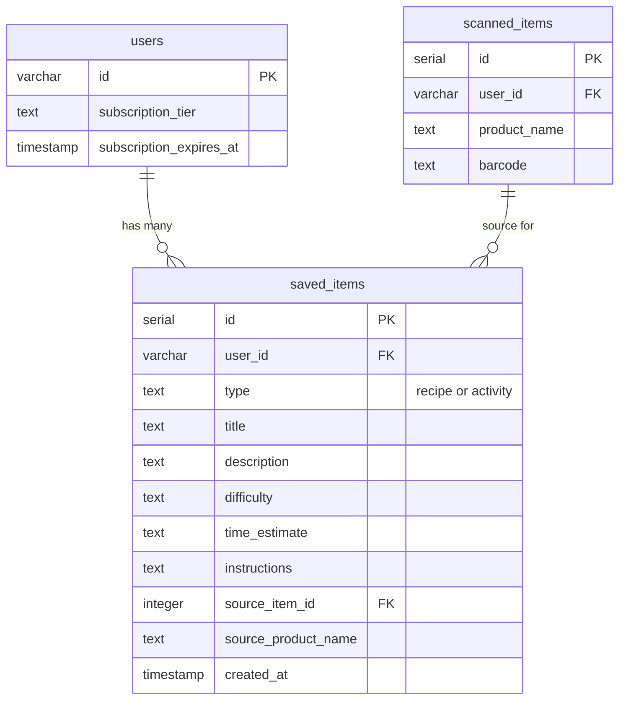

# Recipe & Activity Library

## Enhancement Summary

**Reviewed on:** 2026-02-03
**Reviewers:** DHH-style reviewer, Kieran TypeScript reviewer, Code simplicity reviewer

### Key Simplifications from Review

1. **Collapsed 6 phases to 2** - Backend + Frontend (no artificial boundaries)
2. **Removed `SELECT FOR UPDATE`** - Simple count check is sufficient for mobile app
3. **Removed state machine** - `useState` for save button instead
4. **Removed query key factory** - Inline keys following existing patterns
5. **Removed UpgradeModal** - `Alert.alert()` until premium purchasing exists
6. **Removed sharing utility file** - Inline 5 lines of `Share.share()`
7. **Removed OverLimitBanner** - Disabled button IS the feedback
8. **Changed pgEnum to text** - Consistent with existing codebase patterns

### Simplifications Applied

| Removed                             | Reason                          | Alternative                           |
| ----------------------------------- | ------------------------------- | ------------------------------------- |
| `shareCount`, `lastSharedAt` fields | YAGNI - no use case yet         | Add in v2 if needed                   |
| Cleanup job for grace period        | Over-engineering                | Soft-cap: can't add until under limit |
| Push notifications for grace period | Complex infrastructure          | In-app banner sufficient              |
| Optimistic updates                  | Not used elsewhere in codebase  | Simple `invalidateQueries` pattern    |
| Skeleton loader                     | Only 6 items max for free users | Simple spinner                        |
| `SELECT FOR UPDATE` transaction     | Overkill for mobile app         | Simple count check                    |
| SaveButton state machine            | Enterprise Java patterns        | Simple `useState`                     |
| Query key factory                   | Premature abstraction           | Inline query keys                     |
| UpgradeModal component              | YAGNI until billing             | `Alert.alert()`                       |
| External sharing utility            | Over-abstraction                | Inline `Share.share()`                |
| OverLimitBanner                     | Unnecessary UI                  | Disabled button + alert               |

---

## Overview

Allow users to save recipe and activity suggestions from scan history for later use. Free users can save up to 6 items total. Premium users get unlimited saves. Includes external sharing and graceful downgrade handling.

## Problem Statement / Motivation

Currently, users see AI-generated recipe and activity suggestions when viewing scanned items, but these suggestions disappear when navigating away. Users have no way to:

- Save recipes they want to try later
- Bookmark activities for their kids (macaroni arts & crafts, baking soda volcano)
- Share interesting suggestions with friends/family

This feature creates a "taste" of premium value for free users (6 saves) while driving upgrade conversions when they hit the limit.

## Proposed Solution

### Core Components

1. **Save Functionality** - Add "Save" button to suggestion cards on ItemDetailScreen
2. **Saved Items Section** - "My Saved Items" in Profile tab with link to full list
3. **SavedItemsScreen** - Dedicated screen for viewing, managing, and sharing saved items
4. **Limit Enforcement** - Server-side simple count check (6 for free, unlimited for premium)
5. **Limit Alert** - `Alert.alert()` when free user hits limit (no modal component)
6. **External Sharing** - Inline `Share.share()` call (no utility file)
7. **Downgrade Handling** - Soft-cap approach (cannot add new items until under limit)

## Technical Approach

### Architecture

```
┌─────────────────────────────────────────────────────────────────────┐
│                           CLIENT                                     │
├─────────────────────────────────────────────────────────────────────┤
│  ItemDetailScreen                                                    │
│  └── SuggestionCard                                                  │
│      └── SaveButton (simple useState, Alert.alert on limit)          │
│                                                                      │
│  ProfileScreen                                                       │
│  └── SavedItemsSection (count + "View All" link)                     │
│                                                                      │
│  SavedItemsScreen (new)                                              │
│  └── FlatList                                                        │
│      └── SavedItemCard (swipe-to-delete, inline share, a11y acts)    │
├─────────────────────────────────────────────────────────────────────┤
│                           SERVER                                     │
├─────────────────────────────────────────────────────────────────────┤
│  POST /api/saved-items          - Create (with simple limit check)   │
│  GET  /api/saved-items          - List all items                     │
│  DELETE /api/saved-items/:id    - Remove (with IDOR check)           │
│  GET  /api/saved-items/count    - Count for UI display               │
├─────────────────────────────────────────────────────────────────────┤
│                          DATABASE                                    │
├─────────────────────────────────────────────────────────────────────┤
│  saved_items table (with composite index on user_id, created_at)     │
└─────────────────────────────────────────────────────────────────────┘
```

### Database Schema

```typescript
// shared/schema.ts

// Type constants (consistent with existing codebase pattern)
export const savedItemTypes = ["recipe", "activity"] as const;
export type SavedItemType = (typeof savedItemTypes)[number];

export const savedItems = pgTable(
  "saved_items",
  {
    id: serial("id").primaryKey(),
    userId: varchar("user_id", { length: 255 })
      .notNull()
      .references(() => users.id, { onDelete: "cascade" }),

    // Content type - text with Zod validation (matches existing patterns)
    type: text("type").notNull(),

    // Saved content (frozen at save time - GPT output is non-deterministic)
    title: text("title").notNull(),
    description: text("description"),
    difficulty: text("difficulty"),
    timeEstimate: text("time_estimate"),
    instructions: text("instructions"), // Full recipe/activity steps

    // Source reference
    sourceItemId: integer("source_item_id").references(() => scannedItems.id, {
      onDelete: "set null",
    }),
    sourceProductName: text("source_product_name"), // Denormalized for display when source deleted

    // Metadata
    createdAt: timestamp("created_at", { withTimezone: true })
      .defaultNow()
      .notNull(),
  },
  (table) => ({
    // COMPOSITE INDEX for primary query pattern: WHERE user_id = ? ORDER BY created_at DESC
    userIdCreatedAtIdx: index("saved_items_user_id_created_at_idx").on(
      table.userId,
      table.createdAt,
    ),
  }),
);

// Derive TypeScript types from schema
export type SavedItem = typeof savedItems.$inferSelect;
export type InsertSavedItem = typeof savedItems.$inferInsert;
```

### Zod Validation Schemas

```typescript
// shared/schemas/saved-items.ts
import { z } from "zod";
import { savedItemTypes } from "../schema";

export const savedItemTypeSchema = z.enum(savedItemTypes);

export const createSavedItemSchema = z.object({
  type: savedItemTypeSchema,
  title: z.string().min(1, "Title is required").max(200, "Title too long"),
  description: z.string().max(2000).optional(),
  difficulty: z.string().max(50).optional(),
  timeEstimate: z.string().max(50).optional(),
  instructions: z.string().max(10000).optional(),
  sourceItemId: z.number().int().positive().optional(),
  sourceProductName: z.string().max(200).optional(),
});

export type CreateSavedItemInput = z.infer<typeof createSavedItemSchema>;
```

### IStorage Interface Updates

```typescript
// server/storage.ts - add to IStorage interface
export interface IStorage {
  // ... existing methods

  // Saved items
  getSavedItems(userId: string): Promise<SavedItem[]>;
  getSavedItemCount(userId: string): Promise<number>;
  createSavedItem(
    userId: string,
    item: CreateSavedItemInput,
  ): Promise<SavedItem | null>;
  deleteSavedItem(id: number, userId: string): Promise<boolean>;
}
```

**ERD:**



### Implementation Phases

#### Phase 1: Backend

**Tasks:**

- [ ] Add `savedItemTypes` constant and `savedItems` table to `shared/schema.ts`
- [ ] Run `npm run db:push` to apply schema
- [ ] Create Zod schemas in `shared/schemas/saved-items.ts`
- [ ] Update `IStorage` interface in `server/storage.ts`
- [ ] Implement storage methods:
  - `getSavedItems(userId)` - returns all items (exclude instructions for list)
  - `getSavedItemCount(userId)` - for UI display
  - `createSavedItem(userId, data)` - with simple count check
  - `deleteSavedItem(id, userId)` - with IDOR protection
- [ ] Add API routes to `server/routes.ts`
- [ ] Write unit tests for storage methods

**Storage Implementation:**

```typescript
// server/storage.ts
async getSavedItems(userId: string): Promise<SavedItem[]> {
  return db
    .select({
      id: savedItems.id,
      type: savedItems.type,
      title: savedItems.title,
      description: savedItems.description,
      sourceProductName: savedItems.sourceProductName,
      createdAt: savedItems.createdAt,
      // Exclude instructions from list - fetch on detail view if needed
    })
    .from(savedItems)
    .where(eq(savedItems.userId, userId))
    .orderBy(desc(savedItems.createdAt));
}

async getSavedItemCount(userId: string): Promise<number> {
  const [result] = await db
    .select({ count: sql<number>`count(*)::int` })
    .from(savedItems)
    .where(eq(savedItems.userId, userId));
  return result?.count ?? 0;
}

async createSavedItem(
  userId: string,
  itemData: CreateSavedItemInput
): Promise<SavedItem | null> {
  // Simple count check - sufficient for single-user mobile app
  // Worst case race condition: user gets 7 items instead of 6. Not catastrophic.
  const count = await this.getSavedItemCount(userId);
  const isPremium = await this.isPremiumUser(userId);
  const limit = isPremium ? Infinity : 6;

  if (count >= limit) {
    return null; // Signal limit reached
  }

  const [item] = await db
    .insert(savedItems)
    .values({ ...itemData, userId })
    .returning();

  return item;
}

async deleteSavedItem(id: number, userId: string): Promise<boolean> {
  // IDOR protection: only delete if owned by user
  const result = await db
    .delete(savedItems)
    .where(and(eq(savedItems.id, id), eq(savedItems.userId, userId)))
    .returning({ id: savedItems.id });

  return result.length > 0;
}
```

**API Routes:**

```typescript
// server/routes.ts - add saved items endpoints

app.get("/api/saved-items", requireAuth, async (req, res) => {
  const items = await storage.getSavedItems(req.userId!);
  res.json(items);
});

app.get("/api/saved-items/count", requireAuth, async (req, res) => {
  const count = await storage.getSavedItemCount(req.userId!);
  res.json({ count });
});

app.post("/api/saved-items", requireAuth, async (req, res) => {
  const parsed = createSavedItemSchema.safeParse(req.body);
  if (!parsed.success) {
    return res.status(400).json({ error: parsed.error.flatten() });
  }

  const item = await storage.createSavedItem(req.userId!, parsed.data);
  if (!item) {
    return res.status(403).json({ error: "LIMIT_REACHED" });
  }

  res.status(201).json(item);
});

app.delete("/api/saved-items/:id", requireAuth, async (req, res) => {
  const id = parseInt(req.params.id, 10);
  if (isNaN(id) || id <= 0) {
    return res.status(400).json({ error: "Invalid item ID" });
  }

  // IDOR protection built into deleteSavedItem
  const deleted = await storage.deleteSavedItem(id, req.userId!);
  if (!deleted) {
    return res.status(404).json({ error: "Item not found" });
  }

  res.status(204).send();
});
```

**Files:**

- `shared/schema.ts` - Add savedItems table
- `shared/schemas/saved-items.ts` - Create Zod schemas
- `server/storage.ts` - Add IStorage interface + implementation
- `server/routes.ts` - Add 4 endpoints
- `server/__tests__/saved-items.test.ts` - Unit tests

**Acceptance Criteria:**

- [ ] Schema migrates without error
- [ ] API endpoints return correct data
- [ ] IDOR protection: user A cannot access user B's items (returns 404)
- [ ] Limit check returns 403 when at capacity

#### Phase 2: Frontend

**Tasks:**

- [ ] Create `useSavedItems` hook with TanStack Query
- [ ] Add `SaveButton` component with simple `useState`
- [ ] Add `SavedItemsSection` to ProfileScreen (count + "View All")
- [ ] Create `SavedItemsScreen` with FlatList
- [ ] Create `SavedItemCard` with swipe-to-delete and accessibility actions
- [ ] Add navigation route to ProfileStackNavigator
- [ ] Write unit tests for hooks

**SaveButton (simple useState, no state machine):**

```typescript
// client/components/SaveButton.tsx
function SaveButton({ item, onSaved }: Props) {
  const [isSaving, setIsSaving] = useState(false);
  const [isSaved, setIsSaved] = useState(false);
  const savingRef = useRef(false); // Prevent double-tap

  const handleSave = async () => {
    if (savingRef.current || isSaved) return;
    savingRef.current = true;
    setIsSaving(true);

    try {
      const response = await apiRequest("POST", "/api/saved-items", item);
      if (response.ok) {
        setIsSaved(true);
        Haptics.notificationAsync(Haptics.NotificationFeedbackType.Success);
        onSaved?.();
      } else if (response.status === 403) {
        // Limit reached
        Alert.alert("Limit Reached", "Free users can save up to 6 items. Delete existing items to save more.");
      }
    } catch {
      Haptics.notificationAsync(Haptics.NotificationFeedbackType.Error);
    } finally {
      setIsSaving(false);
      savingRef.current = false;
    }
  };

  return (
    <Pressable
      onPress={handleSave}
      disabled={isSaving || isSaved}
      accessibilityLabel={isSaved ? `${item.title} saved` : `Save ${item.title}`}
      accessibilityHint="Double tap to save"
    >
      {isSaving ? <ActivityIndicator /> : <Feather name={isSaved ? "check" : "bookmark"} />}
    </Pressable>
  );
}
```

**SavedItemCard with inline sharing (no utility file):**

```typescript
// client/components/SavedItemCard.tsx
function SavedItemCard({ item, onDelete }: Props) {
  const handleShare = async () => {
    const message = `${item.title}\n\n${item.description || ""}\n\nFrom NutriScan`;
    await Share.share({ message });
  };

  const handleDelete = () => {
    AccessibilityInfo.announceForAccessibility(`Deleting ${item.title}`);
    onDelete(item.id);
  };

  return (
    <ReanimatedSwipeable
      renderRightActions={() => <DeleteAction onPress={handleDelete} />}
    >
      <Pressable
        accessibilityActions={[
          { name: "delete", label: "Delete from saved items" },
          { name: "share", label: "Share this item" },
        ]}
        onAccessibilityAction={(event) => {
          if (event.nativeEvent.actionName === "delete") handleDelete();
          if (event.nativeEvent.actionName === "share") handleShare();
        }}
      >
        {/* Card content */}
      </Pressable>
    </ReanimatedSwipeable>
  );
}
```

**useSavedItems hook (inline query keys):**

```typescript
// client/hooks/useSavedItems.ts
export function useSavedItems() {
  return useQuery({
    queryKey: ["/api/saved-items"],
    queryFn: () => apiRequest("GET", "/api/saved-items").then((r) => r.json()),
  });
}

export function useSavedItemCount() {
  return useQuery({
    queryKey: ["/api/saved-items/count"],
    queryFn: () =>
      apiRequest("GET", "/api/saved-items/count").then((r) => r.json()),
  });
}

export function useDeleteSavedItem() {
  const queryClient = useQueryClient();

  return useMutation({
    mutationFn: (id: number) => apiRequest("DELETE", `/api/saved-items/${id}`),
    onSuccess: () => {
      queryClient.invalidateQueries({ queryKey: ["/api/saved-items"] });
    },
  });
}
```

**Files:**

- `client/hooks/useSavedItems.ts` - Create hook
- `client/components/SaveButton.tsx` - Simple useState component
- `client/components/SavedItemCard.tsx` - With swipe + accessibility actions
- `client/screens/SavedItemsScreen.tsx` - FlatList screen
- `client/screens/ProfileScreen.tsx` - Add SavedItemsSection
- `client/navigation/ProfileStackNavigator.tsx` - Add route
- `client/types/navigation.ts` - Add screen type
- `client/lib/__tests__/useSavedItems.test.ts` - Unit tests

**Acceptance Criteria:**

- [ ] Save button appears on suggestion cards
- [ ] Ref-based guard prevents duplicate saves on double-tap
- [ ] Haptic feedback on save
- [ ] Button shows "Saved" state after saving
- [ ] 7th save attempt shows Alert (free user)
- [ ] "My Saved Items" section visible in Profile
- [ ] Swipe-to-delete works
- [ ] VoiceOver/TalkBack users can delete via accessibility actions
- [ ] Empty state shown when no items

## Acceptance Criteria

### Functional Requirements

- [ ] Users can save recipes and activities from suggestion cards
- [ ] Saved items appear in "My Saved Items" section in Profile
- [ ] Free users limited to 6 total saved items
- [ ] Premium users can save unlimited items
- [ ] Users can delete saved items via swipe OR accessibility action
- [ ] Users can share saved items via native share sheet
- [ ] Over-limit users cannot save (403 response, Alert shown)

### Non-Functional Requirements

- [ ] Save operation completes in < 500ms
- [ ] Saved items list loads in < 1s
- [ ] IDOR protection on all endpoints (return 404 for wrong owner)

### Security Requirements

- [ ] All inputs validated with Zod schemas
- [ ] IDOR check: verify `item.userId === req.userId`, return 404 if not
- [ ] No enumeration: same 404 response for "not found" and "wrong owner"

### Accessibility Requirements

- [ ] Swipe-to-delete has accessibility action alternative (WCAG 2.5.1)
- [ ] All interactive elements have labels with item context
- [ ] 44x44pt minimum touch targets

### Quality Gates

- [ ] Unit tests for storage methods
- [ ] Unit tests for hooks (useSavedItems)
- [ ] Code review approval

## Dependencies & Prerequisites

1. **Subscription system** - Must be functional for limit enforcement
   - Reference: `docs/plans/2026-02-01-feat-subscription-feature-gating-plan.md`
2. **ItemDetailScreen** - Must have suggestion cards to add save buttons to
3. **ProfileScreen** - Must have space for new section

## Risk Analysis & Mitigation

| Risk                                | Impact                           | Likelihood | Mitigation                                     |
| ----------------------------------- | -------------------------------- | ---------- | ---------------------------------------------- |
| Race condition on save limit        | User saves 7 items instead of 6  | Low        | Acceptable - not catastrophic for a mobile app |
| Swipe gesture inaccessible          | Screen reader users can't delete | High       | Accessibility actions as alternative           |
| Large instructions field slows list | Poor performance                 | Medium     | Exclude from list query                        |

## Success Metrics

- **Save rate**: % of users who save at least 1 item
- **Upgrade conversion**: % of users who upgrade after hitting limit
- **Retention impact**: Do savers return more often?
- **Share rate**: Items shared per user per week

## Future Considerations (v2)

- **Share tracking** - Add `shareCount`, `lastSharedAt` when analytics needed
- **AI Health Coach** (paid tier) - Custom recipe generation on demand
- **In-app community sharing** - Share with other NutriScan users
- **Activity categories** - Arts & crafts, science experiments, cooking projects
- **Recipe collections** - Organize saved recipes into folders
- **Offline support** - Queue saves for sync on reconnect

## References & Research

### Internal References

- Brainstorm: `docs/brainstorms/2026-02-03-recipe-activity-library-brainstorm.md`
- Subscription gating plan: `docs/plans/2026-02-01-feat-subscription-feature-gating-plan.md`
- Patterns: `docs/PATTERNS.md` (stale closure prevention, IDOR protection, safe areas)
- Schema: `shared/schema.ts`
- Premium types: `shared/types/premium.ts`
- Profile screen: `client/screens/ProfileScreen.tsx`
- Item detail: `client/screens/ItemDetailScreen.tsx`
- Suggestion generation: `server/routes.ts:591-688`

### Key Patterns to Follow

- **Stale closure prevention**: Use ref + state for save button (per `docs/solutions/logic-errors/stale-closure-callback-refs.md`)
- **IDOR protection**: Always verify `item.userId === req.userId`, return 404 (per `docs/PATTERNS.md`)
- **Inline query keys**: Use route-based keys like `["/api/saved-items"]` (consistent with existing codebase)
- **Safe areas**: Use `useSafeAreaInsets()` for new screens
- **Haptic feedback**: Success haptic on save, error haptic on failure
- **Accessibility actions**: Required for gesture-based interactions

### External Documentation

- [TanStack Query v5 - Mutations](https://tanstack.com/query/latest/docs/react/guides/mutations)
- [React Native Gesture Handler - ReanimatedSwipeable](https://docs.swmansion.com/react-native-gesture-handler/docs/components/reanimated_swipeable)
- [React Native Share API](https://reactnative.dev/docs/share)
- [React Native Accessibility Actions](https://reactnative.dev/docs/accessibility#accessibility-actions)
